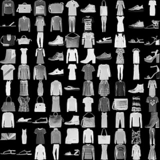
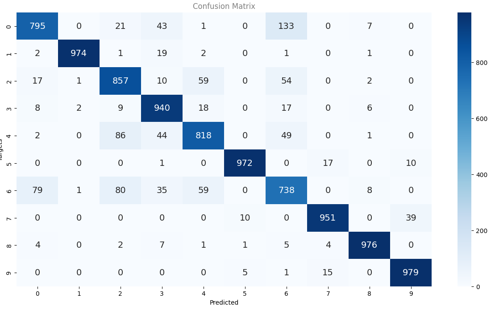

# Clothing classification Multi-Layer Perceptron

A clothing classification project to practice PyTorch. It uses a Multi-Layer Perceptron to classify images from the Fashion MNIST dataset that you can find here on Kaggle : https://www.kaggle.com/datasets/zalando-research/fashionmnist

## Results

The perceptron is a pretty naive approach, but for tiny and simple images like the ones from the Fashion MNIST dataset, we can see that it gives fairly good results, as shown is the following confusion matrix :

