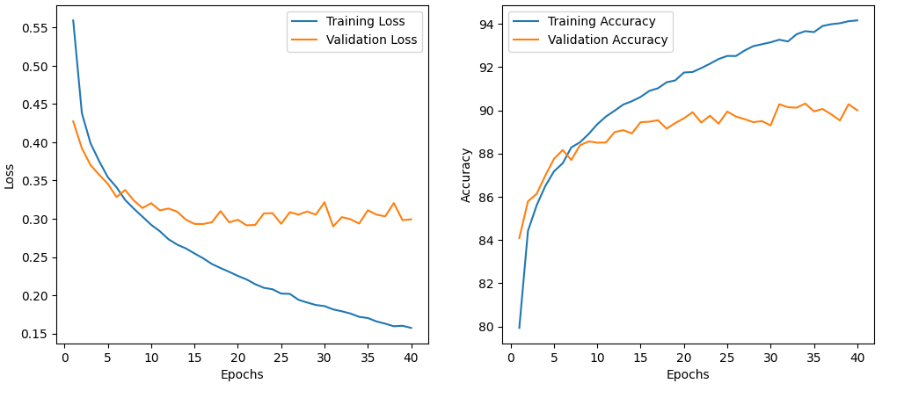

# Clothing classification Multi-Layer Perceptron

A clothing classification project to practice PyTorch. It uses a Multi-Layer Perceptron to classify images from the Fashion MNIST dataset that you can find here on Kaggle : https://www.kaggle.com/datasets/zalando-research/fashionmnist

## Results

Here is two graphs representing the loss and accuracy of the training and validation session as they progress.

The perceptron is a pretty naive approach, but for tiny and simple images like the ones from the Fashion MNIST dataset, we can see that it gives fairly good results, as shown is the following confusion matrix :

### Jupyter Notebook

You can find in the `doc` folder of this repository a Jupyter Notebook with an interactive version of the script use to train this model, as well as graphs showing training progress and results. You can also find a test of the network where we try to make the MLP predict the class of an object inside the test dataset.